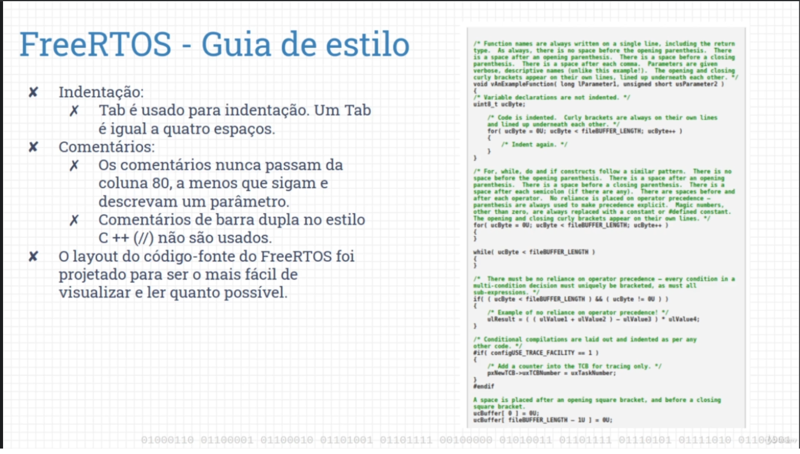

# Personal notes from course: "Primeiros passos com o FreeRTOS e ESP32"
## Guilherme Renoldi

## Good naming conventions:

### Source: Fabio Souza's Udemy course

## Style guidelines for FsreeRTOS code

### Source: Fabio Souza's Udemy course
